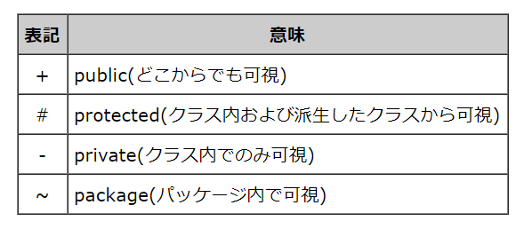
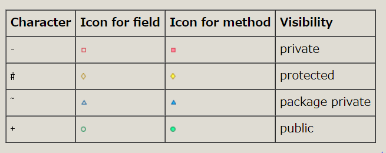
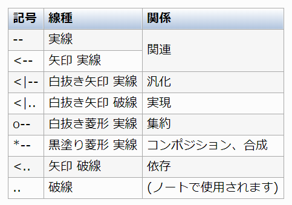
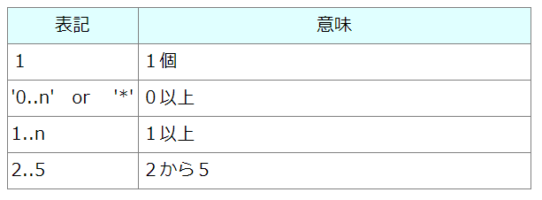
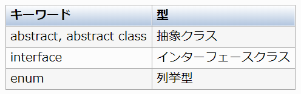

# PlantUMLを通じてクラス図の書き方を学ぶ

## はじめに
---
ソフトウェアの仕様書、設計書の作成や管理を効率化するために、Markdown + PlantUMLによる作成方法を日々模索しています。
しかしながら、そもそもUML図の正式な書き方というものをちゃんと分かっていないというのが正直なところなので、PlantUMLを通じてUMLの各種図の書き方を勉強していきます。

- 本稿のテーマは、「UMLによるクラス図の書き方」です。
- 本稿におけるUML図の作成は、Markdown + PlantUMLがベースであることを前提とします。

## 目次
---
<!-- TOC -->

- [PlantUMLを通じてクラス図の書き方を学ぶ](#plantumlを通じてクラス図の書き方を学ぶ)
    - [はじめに](#はじめに)
    - [目次](#目次)
    - [クラス図とは](#クラス図とは)
    - [クラス図を構成する要素](#クラス図を構成する要素)
        - [クラス(Class)](#クラスclass)
        - [クラス間の関係と線種](#クラス間の関係と線種)
        - [関連(Association)](#関連association)
        - [汎化(Generalization)と特化(Specialization)](#汎化generalizationと特化specialization)
        - [実現(Realization)](#実現realization)
        - [集約(Aggregation)と合成(Composition)](#集約aggregationと合成composition)
        - [依存(Dependency)](#依存dependency)
        - [ロール名(Role name)](#ロール名role-name)
        - [多重度(Multiplicity)](#多重度multiplicity)
        - [ステレオタイプ(Stereotype)](#ステレオタイプstereotype)
        - [制約(Constraint)](#制約constraint)
        - [特殊クラス](#特殊クラス)
        - [ロリポップ](#ロリポップ)
    - [パッケージ](#パッケージ)
        - [パッケージの定義](#パッケージの定義)
        - [パッケージスタイル](#パッケージスタイル)
        - [ネームスペース](#ネームスペース)
    - [ノート](#ノート)
        - [クラスに対するノート](#クラスに対するノート)
        - [関係を使ったノート](#関係を使ったノート)
        - [リンクへのノート](#リンクへのノート)
    - [オブジェクト図](#オブジェクト図)
    - [パッケージ図](#パッケージ図)
    - [参考資料](#参考資料)

<!-- /TOC -->

## クラス図とは
---
- モデルの静的な構造を表す図であり、問題領域やシステムの構造を表現する。
- 全体、パッケージ単位、機能単位など、様々な視点で作成できる。

## クラス図を構成する要素
---

### クラス(Class)

- 長方形の中を３区画に分割し、上から**クラス名**、**属性**、**操作**を記述する。
- クラス名の上には"<<>>"で囲まれたステレオタイプを付ける事ができる。
- 属性はデータを表し、**可視性 名前:型 = デフォルト値**という形式で書く。
- 操作は振る舞いを表し**可視性 名前(パラメータ):返り値**という形式で表す。
- パラメータは、**名前:型=デフォルト値**をコンマで区切って並べる。staticな属性や操作は**下線**を付けて表現する。

可視性は下記の表のパターンがある。


これらをPlantUMLで書くと下記の表のようになる。


PlantUMLによるクラス図の記法は下記の通り。

```
class Dummy{
    - field1
    # field2
    {static} field3
    ~ method1()
    + method2()
}
```

このコードによって下記のようなクラス図が作成される。

```plantuml
class Dummy{
    - field1
    # field2
    {static} field3
    ~ method1()
    + method2()
}
```

PlantUMLによるアイコン表示を適用したくない場合は、**コマンド skinparam classAttributeIconSize 0**をコードの先頭に記述する。

```
skinparam classAttributeIconSize 0

class Dummy{
    - field1
    # field2
    {static} field3
    ~ method1()
    + method2()
}
```

```plantuml
skinparam classAttributeIconSize 0

class Dummy{
    - field1
    # field2
    {static} field3
    ~ method1()
    + method2()
}
```

### クラス間の関係と線種

- PlantUMLでは、クラス間の関係を下記の形式で記述する。

```
クラス名 線種の記号 クラス名 [: ラベル]
```

- クラス名に英数字以外を使いたい場合は"(ダブルクオテーション)で囲む。
- 日本語の場合は " がないとうまく表示されない場合があるので、囲っておいた方が安全である。

- PlantUMLでの記述例は下記の通り。

```
ClassA -- ClassB
"クラスC" -- "クラスD" : 関係
```

```plantuml
ClassA -- ClassB
"クラスC" -- "クラスD" : 関係
```

- ラベルの最初または最後に < か > を使って、他のオブジェクトへの関係を示す矢印を追加できる。

```
class Car

Driver - Car : drives >
Car *- Wheel : have 4 >
Car -- Person : < owns
```

```plantuml
class Car

Driver - Car : drives >
Car *- Wheel : have 4 >
Car -- Person : < owns
```

- :に続けてフィールド名やメソッド名を記述すると、フィールドやメソッドを宣言できる。

```
Object <|-- ArrayList

Object : equals()
ArrayList : Object[] elementData
ArrayList : size()
```

```plantuml
Object <|-- ArrayList

Object : equals()
ArrayList : Object[] elementData
ArrayList : size()
```

- クラス間の関係を表す線種は下記の表のようになる。


### 関連(Association)

- クラス間に、参照や実体を保持するなどの関係があることを表す。
- 線の両端には矢印をつけることができ、矢印がある場合はその方向にのみ関連があることを示す。
- これを誘導可能性(Navigability)と言い、矢印の無い関連は誘導可能性が未知、あるいは双方向を意味する。

```
Control -- View
Control --> Model
```

```plantuml
Control -- View
Control --> Model
```

### 汎化(Generalization)と特化(Specialization)

- 異なるクラス間で共通している部分を見出す事を汎化という。
- 共通していない個別の性質について考える事を特化という。
- 汎化を意識して共通部分を別に作る実装手段が継承である。

車クラスを継承して、バスクラスとトラッククラスが作られる例。

```plantuml
skinparam classAttributeIconSize 0

Car <|--- Bus
Car <|--- Truck

Car : - marker
Car : - type
Car : + Drive()
Car : + Turn()
Car : + Stop()

Bus : - drivingRoot
Bus : - fare
Bus : + Announce()
Bus : + OpenCloseDoor()

Truck : - maximumLoad
Truck : + Stack()
Truck : + Unload()
```

PlantUMLでは下記のように記述する。

```
skinparam classAttributeIconSize 0

Car <|--- Bus
Car <|--- Truck

Car : - marker
Car : - type
Car : + Drive()
Car : + Turn()
Car : + Stop()

Bus : - drivingRoot
Bus : - fare
Bus : + Announce()
Bus : + OpenCloseDoor()

Truck : - maximumLoad
Truck : + Stack()
Truck : + Unload()
```

### 実現(Realization)

- Javaでいうinterfaceと同等の意味。
- 相手を具象化する関係の際に用いる表現。
- インターフェースとは、定数を指定したメンバ変数と抽象メソッドで構成され、クラスに実装して使用する。

実現を表すクラス図の例

```
skinparam classAttributeIconSize 0

class Operation <<interface>>
Operation <|... Plane
Operation <|... Ship
Operation <|... Car

Operation : + Drive()
Operation : + Stop()
```

```plantuml
skinparam classAttributeIconSize 0

class Operation <<interface>>
Operation <|... Plane
Operation <|... Ship
Operation <|... Car

Operation : + Drive()
Operation : + Stop()
```

### 集約(Aggregation)と合成(Composition)

- 集約は関連の一種で、オブジェクトが複数集まって全体を構成する関係である。
- 双方のオブジェクト間に「全体 - 部分」の関係が成り立っている。
- 合成は関連の一種で集約よりも結びつきが強い場合、例えば「全体 - 部分」において双方が存在して初めて成り立つような関係のときに用いられる。

集約を表すクラス図の例

```
skinparam classAttributeIconSize 0
Taxi o-- Crew

Taxi : - companyName
Taxi : - startingFare
```

```plantuml
skinparam classAttributeIconSize 0
Taxi o-- Crew

Taxi : - companyName
Taxi : - startingFare
```

合成を表すクラス図の例(タイヤやエンジンがないと車が動かない)

```plantuml
skinparam classAttributeIconSize 0

Car *--- Tire
Car *--- Engine

Car : - maker
Car : - type
Car : + Drive()
Car : + Turn()
Car : + Stop()

Tire : - diameter
Tire : + Rotate()
Tire : + Stop()

Engine : - engineDisplacement
Engine : + Start()
Engine : + Stop()
```

### 依存(Dependency)

- 相手の状態、もしくはイベントに対して影響を受ける関係のときに用いる表現である。
- 変更すると他方にも変更が生じるような関係。

依存を表すクラス図の例

```
FuelMeter ..> FuelTank : Dependency
```

```plantuml
FuelMeter ..> FuelTank : Dependency
```

```
skinparam classAttributeIconSize 0

F1Driver ..> F1Machine

F1Driver : - nationality
F1Driver : - age
F1Driver : - career
F1Driver : + Drive()

F1Machine : - team
F1Machine : - sponsor
F1Machine : + Drive()
F1Machine : + Turn()
F1Machine : + Stop()
```

```plantuml
skinparam classAttributeIconSize 0

F1Driver ..> F1Machine

F1Driver : - nationality
F1Driver : - age
F1Driver : - career
F1Driver : + Drive()

F1Machine : - team
F1Machine : - sponsor
F1Machine : + Drive()
F1Machine : + Turn()
F1Machine : + Stop()
```

### ロール名(Role name)

- 関連の端に書かれる、関連先の役割を表す名前。
- 設計レベルでは、関連先を保持するための名前、つまり属性名を付けることが多い。

### 多重度(Multiplicity)

- 関連の端に書かれ、関連の張られたオブジェクト間の数的関係を表す。
- 具体的な数値の他に、"0..n"や"*"(共に0以上)、"1..n"(1以上)、"2..7"(2から7)のように任意の値を設定できる。

```
クラス名 "多重度" 線種 "多重度" クラス名 [: ラベル]
```

多重度の表記パターン



多重度を記入したクラス図の例

```
Car "1" *--- "4" Tire
Car "1" o--- "0..*" ParkingLot : 1 - Many
```

```plantuml
Car "1" *--- "4" Tire
Car "1" o--- "0..*" ParkingLot : 1 - Many
```

### ステレオタイプ(Stereotype)

- UMLの拡張メカニズムで、アプリケーションや問題領域固有の意味を、わかりやすくモデルに表現するために付加する文字列。
- 同一のモデル要素を、意味的に分類することができる。
- 例えば、interfaceのステレオタイプをつけたクラスは、振る舞いのインターフェースのみ定義したクラスであることを明示する。

### 制約(Constraint)

- {}に囲んで制約を課すことができる。

下記は、コントローラに与えられるデータが年月日によって整列された状態で保持される場合の例。

```
skinparam classAttributeIconSize 0

Controller "1" o--> "0..n" Data : {sort by date}

Data : - id
Data : - date
Data : - arrivalTime
Data : - leavingTime
```

```plantuml
skinparam classAttributeIconSize 0

Controller "1" o--> "0..n" Data : {sort by date}

Data : - id
Data : - date
Data : - arrivalTime
Data : - leavingTime
```

### 特殊クラス



```
enum FigureType {
    unknown = -1
    rectangle
    polygon
    ellipse
}

abstract Figure

class Rectangle

interface Comparable {
    {abstract} int compare(Comparable *other)
}

Figure <|-- Rectangle
Rectangle .|> Comparable
```

```plantuml
enum FigureType {
    unknown = -1
    rectangle
    polygon
    ellipse
}

abstract Figure

class Rectangle

interface Comparable {
    {abstract} int compare(Comparable *other)
}

Figure <|-- Rectangle
Rectangle .|> Comparable
```

### ロリポップ

- インターフェースを提供しているということを強調する場合は、ロリポップ(棒付きキャンディー)で省略表記することがある。
- PlantUMLでは、関係の線種に ()-- を使う。

```
Comparable ()-- RationalNumber
```

```plantuml
Comparable ()-- RationalNumber
```

## パッケージ
---

### パッケージの定義

```
package "Package 1" {
    ClassA <|-- CLassB
}

package "Package 2" {
    ClassA <|-- ClassC
    ClassC *- ClassD
}
```

```plantuml
package "Package 1" {
    ClassA <|-- CLassB
}

package "Package 2" {
    ClassA <|-- ClassC
    ClassC *- ClassD
}
```

### パッケージスタイル

- スタイルのデフォルトはフォルダスタイル。
- ステレオタイプで別のタイプを指定し、形状を変更することができる。

```
package NodeStyle <<Node>> {
    class Class1
}

package FrameStyle <<Frame>> {
    class Class2
}

package CloudStyle <<Cloud>> {
    class Class3
}

package DatabaseStyle <<Database>> {
    class Class4
}

package FolderStyle <<Folder>> {
    class Class5
}

package RectStyle <<Rectangle>> {
    class Class6
}
```

```plantuml
package NodeStyle <<Node>> {
    class Class1
}

package FrameStyle <<Frame>> {
    class Class2
}

package CloudStyle <<Cloud>> {
    class Class3
}

package DatabaseStyle <<Database>> {
    class Class4
}

package FolderStyle <<Folder>> {
    class Class5
}

package RectStyle <<Rectangle>> {
    class Class6
}
```

### ネームスペース

- 同じ名前のクラス名をネームスペースで分けて定義するために**namespace**キーワードを使用する。
- namespaceキーワードは、packageと同じスタイルで記述する。
- ネームスペースをまたいでクラス関係を記述する場合は、**ピリオド**でつないで"ネームスペース名"."クラス名"という形式でクラスを指定する。

```
abstract class AbstPerson

namespace Space1 {
    .AbstPerson <|-- Person
    Meeting o-- Person
    .AbstPerson <|-- Meeting
}

namespace Space2 {
    Space1.Person <|-- Person
    .AbstPerson <|-- Person
    Space1.Meeting o-- Person
}

AbstPerson <|-- Space3.Person
```

```plantuml
abstract class AbstPerson

namespace Space1 {
    .AbstPerson <|-- Person
    Meeting o-- Person
    .AbstPerson <|-- Meeting
}

namespace Space2 {
    Space1.Person <|-- Person
    .AbstPerson <|-- Person
    Space1.Meeting o-- Person
}

AbstPerson <|-- Space3.Person
```

## ノート
---

### クラスに対するノート

クラスに対してノート(コメント)を付けることができる。

```
note position of クラス名 : コメント
```
```
クラスの定義
note position : コメント
```

positionには下記のキーワードから指定する。

- top
- bottom
- left
- right

```
class Class1
class Class2

Class1 - Class2

note top of Class1 : Class1の上側に\nコメント表示
note left of Class1 : Class1の左側に\nコメント表示
note bottom of Class2 : Class2の下側に\nコメント表示
note right of Class2 : Class2の右側に\nコメント表示
```

```plantuml
class Class1
class Class2

Class1 - Class2

note top of Class1 : Class1の上側に\nコメント表示
note left of Class1 : Class1の左側に\nコメント表示
note bottom of Class2 : Class2の下側に\nコメント表示
note right of Class2 : Class2の右側に\nコメント表示
```

### 関係を使ったノート

別名のつけてノートの要素を作り、それをクラスにリンクさせることでコメントを表示する。

```
class Class1
class Class2

Class1 <|-- Class2

note "Class1に対するコメント" as Note1
Class1 . Note1

note "Class1と2の両方に\n対するコメント" as Note2
Class1 .. Note2
Note2 .. Class2

note "対象をしてしなければ\nフローティングになる" as Note3
```

```plantuml
class Class1
class Class2

Class1 <|-- Class2

note "Class1に対するコメント" as Note1
Class1 . Note1

note "Class1と2の両方に\n対するコメント" as Note2
Class1 .. Note2
Note2 .. Class2

note "対象をしてしなければ\nフローティングになる" as Note3
```

### リンクへのノート

クラスの関係の記述の直下にノートを書くと関係のリンクへのノートになる。

```
クラス関係の記述
note position on link : コメント
```

```
class Class1

Class1 --> Class2 : link 1
note on link : link1に対する\nコメント

Class1 --> Class3 : link 2
note right on link : link2に対する\nコメント
```

```plantuml
class Class1

Class1 --> Class2 : link 1
note on link : link1に対する\nコメント

Class1 --> Class3 : link 2
note right on link : link2に対する\nコメント
```

## オブジェクト図
---

- classの代わりにobjectを使うとオブジェクト図となる。
- ブロックによる定義では英数字しか使えない。
- それ以外の文字を使いたい場合は一度**as**で別名を付けた後にメンバを追加する。
- クラスという集合の中にオブジェクトが属していると考える。
- クラス図だけでは抽象的な図しか書けないので、オブジェクト図でもっと詳しい補足をする。

```plantuml
object Object1 {
    id = 1234
    name = "Alice"
}

object "<u>bar:Object2</u>" as bar
bar : id = 4321
bar : name = "Bob"
```

## パッケージ図
---

- パッケージ同士の依存関係を描画することで論理的なグルーピングをするための図。
- インポートの場合は対象のパッケージや要素が取り込まれるが、アクセスの場合は取り込まない。
- 呼び出すことができるのは、インポートするパッケージのみ。
- PlantUMLにはパッケージ図が用意されていない。
- パッケージ - クラス間のリンクはできない。

```plantuml
package Search{
}

package Drawing{
}

Search .> Drawing : <<import>>

package "Input/Output" as io{
}

Search ..> io : <<access>>

package Database{
}

io +-- Database
```

## 参考資料
---
- [PlantUMLの公式ドキュメント](http://plantuml.com/class-diagram)
- [IT専科 > UML入門 > クラス図](http://www.itsenka.com/contents/development/uml/class.html)
- [UML超入門](http://objectclub.jp/technicaldoc/uml/umlintro)
- [プログラマーズ雑記帳](http://yohshiy.blog.fc2.com/)
- [アジャイルモデルのエッセンス: アジャイルに作れる成果物](https://www.ogis-ri.co.jp/otc/swec/process/am-res/am/artifacts/index.html)