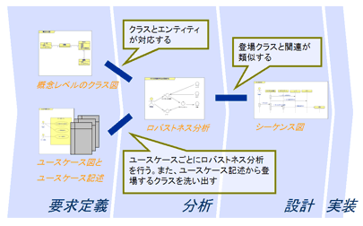

# PlantUMLを通じてロバストネス図の書き方を学ぶ

## はじめに
---
ソフトウェアの仕様書、設計書の作成や管理を効率化するために、Markdown + PlantUMLによる作成方法を日々模索しています。
しかしながら、そもそもUML図の正式な書き方というものをちゃんと分かっていないというのが正直なところなので、PlantUMLを通じてUMLの各種図の書き方を勉強していきます。

- 本稿のテーマは、「UMLによるロバストネス図の書き方」です。
- 本稿におけるUML図の作成は、Markdown + PlantUMLがベースであることを前提とします。

## 目次
---
<!-- TOC -->

- [PlantUMLを通じてロバストネス図の書き方を学ぶ](#plantumlを通じてロバストネス図の書き方を学ぶ)
    - [はじめに](#はじめに)
    - [目次](#目次)
    - [ロバストネス分析の目的](#ロバストネス分析の目的)
    - [ロバストネス図とは](#ロバストネス図とは)
    - [ロバストネス図のシンボル](#ロバストネス図のシンボル)
        - [アクター](#アクター)
        - [バウンダリ(インターフェース)](#バウンダリインターフェース)
        - [エンティティ](#エンティティ)
        - [コントロール](#コントロール)
    - [PlantUMLでの記述例](#plantumlでの記述例)
    - [ロバストネス図とその周囲のダイアグラムの整合性](#ロバストネス図とその周囲のダイアグラムの整合性)
    - [ロバストネス図の秘密](#ロバストネス図の秘密)
        - [コントロールは何から生まれて何になるのか？](#コントロールは何から生まれて何になるのか)
        - [コントロールはユニットテストの良い対象](#コントロールはユニットテストの良い対象)
    - [参考資料](#参考資料)

<!-- /TOC -->

## ロバストネス分析の目的
---
- ロバストネス分析は、詳細設計の前に実施する予備設計である。
- 予備設計をすることで、シーケンス図やクラス図を作成するときに仕様の詳細について調べたり考えたりする時間を省略できる。
- ドメインモデル図、ユースケース図の記述上の足りない観点や疑問点を洗い出し、完全なユースケース記述に近づける。
- これらの分析を行うために描く図がロバストネス図である。

## ロバストネス図とは
---
- ユースケースのステップを分析して、その中のビジネスロジックを検証するための図。
- それまでに分析した他のユースケースと統一の取れた用語を使っていることを確認できる。
- ユースケースが十分にロバストで、開発対象のシステムの利用要求を表現しているかを確認できる。
- ユースケース内で呼び出されるロジックをサポートするオブジェクトやオブジェクトの責務の候補を識別するために使う。
- シーケンス図やクラス図への橋渡しとなる。

## ロバストネス図のシンボル
---
### アクター

- システムとの相互作用においてある役割を果たす人や組織や外部システムで、線で描いた人型で表される。  

### バウンダリ(インターフェース)

- アクターが相互作用する画面やレポート、HTMLページ、システムインターフェースなどのソフトウェア要素を表す。  

### エンティティ

- システム内の情報を意味し、属性及び振る舞いを保持する。一般にデータベース等を利用して永続化されることが多い。  
- 事前に作成したドメインモデル図に現れる各ドメインが、これらのエンティティと対応していなければならない。  
- エンティティがどのドメインにも対応しない場合は、ドメインモデル図への追加するなどの修正をする必要がある。  
- ダイアグラム間の整合性が枠組みとなってお互いの記述を助け、また整合性を通してお互いが洗練されていく。  

### コントロール

- バウンダリとエンティティを繋ぐ役割を果たし、様々な要素との相互作用を管理するためのロジックを実装する。  
- プロセスとも呼ばれる。  
- ユースケースで表現されるシステムとしての機能を提供する。  

## PlantUMLでの記述例
---
PlantUMLのコードは下記の通り。  

```
title Sample of Robustness diagram

'Direction of diagram flow can be selected.
left to right direction

usecase 購読者がニュース一覧を閲覧する

actor 購読者
boundary ニュース一覧画面
control 一覧取得
entity ニュース一覧

購読者 -> ニュース一覧画面 : アクセス
ニュース一覧画面 -> 一覧取得 : 呼び出し
一覧取得 -> ニュース一覧 : 問い合わせ
```

上記のコードより作成されるロバストネス図は下記の通り。  

```plantuml
title Sample of Robustness diagram

'Direction of diagram flow can be selected.
left to right direction

usecase 購読者がニュース一覧を閲覧する

actor 購読者
boundary ニュース一覧画面
control 一覧取得
entity ニュース一覧

購読者 -> ニュース一覧画面 : アクセス
ニュース一覧画面 -> 一覧取得 : 呼び出し
一覧取得 -> ニュース一覧 : 問い合わせ
```

また、パッケージを交えて下記のようにすることも可能。  

```
title Robustness diagram with package

'Direction of diagram flow can be selected.
left to right direction

actor ツール実行ユーザ
entity 給与明細txt

package "給与明細テキスト変換"{

    boundary Gmail
    boundary terminal
    control pdf2txt
    entity 給与明細pdf

    Gmail --> 給与明細pdf
    ツール実行ユーザ -> Gmail : <<給与明細取得>>
    pdf2txt --> 給与明細txt : <<出力>>
    pdf2txt <. 給与明細pdf : <<入力>>
    terminal --> pdf2txt
    ツール実行ユーザ --> terminal : <<給与明細のテキスト化>>
}
```

```plantuml
title Robustness diagram with package

'Direction of diagram flow can be selected.
left to right direction

actor ツール実行ユーザ
entity 給与明細txt

package "給与明細テキスト変換"{

    boundary Gmail
    boundary terminal
    control pdf2txt
    entity 給与明細pdf

    Gmail --> 給与明細pdf
    ツール実行ユーザ -> Gmail : <<給与明細取得>>
    pdf2txt --> 給与明細txt : <<出力>>
    pdf2txt <. 給与明細pdf : <<入力>>
    terminal --> pdf2txt
    ツール実行ユーザ --> terminal : <<給与明細のテキスト化>>
}
```

## ロバストネス図とその周囲のダイアグラムの整合性
---
- ロバストネス分析の結果は、設計工程でも利用される。設計工程では、アーキテクチャが適用されたシーケンス図をロバストネス分析と同じユースケース単位で作成することが一般的である。  
- この分析により、システム内部のメッセージのやり取りをシーケンス図で記述しやすくなる。  
- これは、ロバストネス分析が概念的なシステムの内部の構造を表しており、登場するクラスとその関連が、実際に登場するオブジェクト間の相互作用と類似するからである。  
- 下記の図は、ロバストネス分析が仲介役となってダイアグラム間に必要な整合性が存在することを俯瞰した図である。  
- それぞれのダイアグラムは工程あるいは視点により異なりながらも、それらの間には何らかの形で整合性をとっていることが分かる。  
- 下記図における「概念レベルのクラス図」とは、「ドメインモデル図」とも呼ばれる。  



## ロバストネス図の秘密
---
### コントロールは何から生まれて何になるのか？

- ユースケース記述の各文の主語として考えられるのは、「システム」「利用者」「外部システム」の３種類
- この文の動詞こそが、「システムがすべきこと=実装すべき処理=コントロール」になる。
- その動詞がロバストネス図上でコントロールとして現れ、最終的にはいずれかのクラスのメソッド(複数可)になる。

したがって、  

主語がシステムとなっている文の動詞(@ユースケース記述)  
↓  
コントロール(@ロバストネス図)  
↓  
いずれかのクラスのメソッド(@シーケンス図)  

という風に化ける。  

### コントロールはユニットテストの良い対象

- コントロールは、ユースケース記述つまりは要件から導出されたもの。  
- コントロールをユニットテスト項目とすれば、テスト項目が確実に要件に結び付く。  
- コントロールは、シーケンス図上では一つ以上のメソッドに対応するので、実際はそれらのメソッドをテスト対象にすることになる。  
- ロバストネス図を見れば何をテストすべきかが分かるということは、大きなメリットになる。  

## 参考資料
---
- [Asial/Developers/Blog UMLを描こう](http://blog.asial.co.jp/archive/category/UML)
- [使えるUML 第４回](http://www.umlcert.org/reading/column/uml3_04.html)
- [VSCodeとPlantUMLでロバストネス図を書く](http://tk2000ex.blogspot.com/2017/11/vscodeplantuml.html)
- [ロバストネス図の概要](https://www.ogis-ri.co.jp/otc/swec/process/am-res/am/artifacts/robustnessDiagram.html)
- [ロバストネス分析の目的](https://qiita.com/reoring/items/d3c5bb9506386404b297)
- [PlantUMLでツールの概念図(ロバストネス図)作成](http://kirakenmemo.blogspot.com/2014/11/plantuml.html)