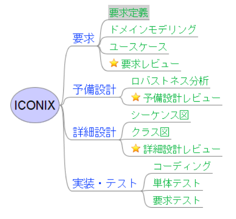
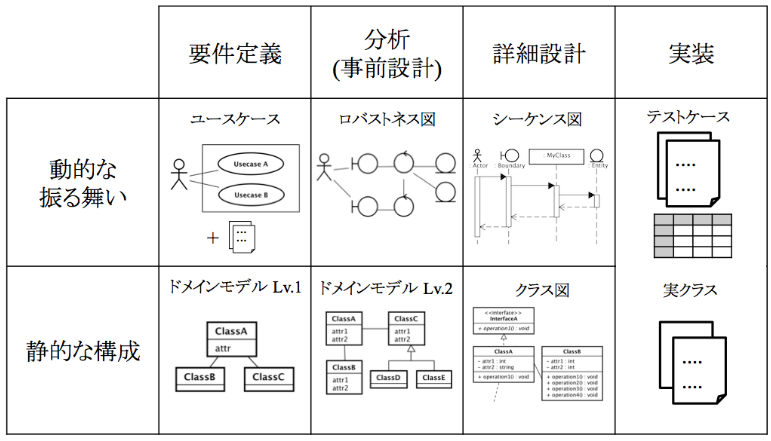
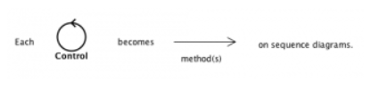
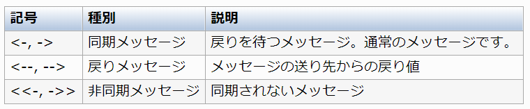
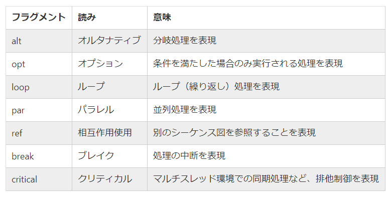

# PlantUMLを通じてシーケンス図の書き方を学ぶ

## はじめに
---
ソフトウェアの仕様書、設計書の作成や管理を効率化するために、Markdown + PlantUMLによる作成方法を日々模索しています。
しかしながら、そもそもUML図の正式な書き方というものをちゃんと分かっていないというのが正直なところなので、PlantUMLを通じてUMLの各種図の書き方を勉強していきます。

- 本稿のテーマは、「UMLによるシーケンス図の書き方」です。
- 本稿におけるUML図の作成は、Markdown + PlantUMLがベースであることを前提とします。

## 目次
---
<!-- TOC -->

- [PlantUMLを通じてシーケンス図の書き方を学ぶ](#plantumlを通じてシーケンス図の書き方を学ぶ)
    - [はじめに](#はじめに)
    - [目次](#目次)
    - [シーケンス図とは](#シーケンス図とは)
    - [設計プロセスにおけるシーケンス図の立ち位置](#設計プロセスにおけるシーケンス図の立ち位置)
    - [シーケンス図の描き方についてのヒント](#シーケンス図の描き方についてのヒント)
        - [ヒント1](#ヒント1)
        - [ヒント2](#ヒント2)
    - [シーケンス図を構成する要素](#シーケンス図を構成する要素)
        - [メッセージ](#メッセージ)
        - [自己メッセージ](#自己メッセージ)
        - [外部とのメッセージのやり取り](#外部とのメッセージのやり取り)
        - [ライフライン](#ライフライン)
        - [実行仕様(イベント)の表現](#実行仕様イベントの表現)
        - [シーケンス図の例: ログイン](#シーケンス図の例-ログイン)
        - [複合フラグメント](#複合フラグメント)
            - [alt 分岐処理の表現例](#alt-分岐処理の表現例)
            - [ref 相互作用使用 別参照](#ref-相互作用使用-別参照)
            - [opt 条件による実行の表現](#opt-条件による実行の表現)
            - [delay 非同期の遅延処理](#delay-非同期の遅延処理)
            - [par 並列処理](#par-並列処理)
            - [loop 繰り返し処理](#loop-繰り返し処理)
            - [break 中断処理](#break-中断処理)
            - [critical 排他制御処理](#critical-排他制御処理)
            - [グループ化](#グループ化)
        - [作成と消滅](#作成と消滅)
        - [上下でメッセージ間でスペースを空ける](#上下でメッセージ間でスペースを空ける)
        - [分離線](#分離線)
        - [ボックス](#ボックス)
        - [ノート](#ノート)
            - [メッセージのノート](#メッセージのノート)
    - [参考資料](#参考資料)

<!-- /TOC -->

## シーケンス図とは
---
- シーケンス図とは、クラスやオブジェクト間のやり取りを時間軸に沿って表現するものである。  
- 詳細設計の成果物の中で最も重要な図。描く際はいきなりゼロから描くのではなく、ロバストネス図を参考にしながら描く。  

## 設計プロセスにおけるシーケンス図の立ち位置
---
- 設計プロセスは、予備設計(あるいは事前設計)と詳細設計の２段階に分けて行われる。  
- 要求定義→予備設計→詳細設計→実装・テストまでを必要最低限のステップで実践的に行うプロセスをICONIXプロセスという。  
- ８割程度完成させたら次のフェーズに進み、前のフェーズの成果物を更に進化させるという段階的な設計。  

ICONIXプロセスの流れ



- 予備設計では、実際のクラスを気にせずに「システム全体としてどう振る舞うべきか」を先に決める。  
- 次の詳細設計で、適用したアーキテクチャの都合を考慮しながらクラスに責務を割り当てていく。  
- 事前にロバストネス図さえ描いていれば、要件定義にきちんと結びついたシーケンス図が描ける。  

## シーケンス図の描き方についてのヒント
---
### ヒント1
- ロバストネス図上の「コントロール」はいずれかのクラスのメソッドとなる。  
- いずれも１対１である必要はない。1つのコントロールが複数のメソッドに対応していても構わない。  
- コントロールは１本の線になり、それがシーケンス図におけるやり取りとなる。  


### ヒント2
- ロバストネス図上の「エンティティ」は全て、シーケンス上に登場する。  
- シーケンス図を描く最大のメリットは、図上で「プリファクタリング」が行えることである。  
- プリファクタリングとは、実装前にシーケンス図を用いて設計を再考・改善する事です。  

## シーケンス図を構成する要素
---
### メッセージ
PlantUMLでは下記のように記述する。  
```
Alice -> Bob : メッセージ
```
```plantuml
Alice -> Bob : メッセージ
```

メッセージ種別と矢印の形状


記述例
```
Alice -> Bob : 同期メッセージ
Alice <-- Bob : 戻りメッセージ

Alice ->> Chuck : 非同期メッセージ
```
```plantuml
Alice -> Bob : 同期メッセージ
Alice <-- Bob : 戻りメッセージ

Alice ->> Chuck : 非同期メッセージ
```

### 自己メッセージ
対象を同じにすると自己メッセージとなる。  
```
Alice -> Alice : 自己メッセージ
```
```plantuml
Alice -> Alice : 自己メッセージ
```

### 外部とのメッセージのやり取り
送り手や受け手がダイアグラム上にない場合は [ または ] を使用する。  
```
[-> Alice : DoWork

Alice ->] : Request
Alice <--]

[<- Alice : Done
```
```plantuml
[-> Alice : DoWork

Alice ->] : Request
Alice <--]

[<- Alice : Done
```

### ライフライン
- ライフラインの要素はメッセージの出現順に左から表示される。  
- 要素名に記号などの英数字以外を使う場合には"で囲む。  
- asキーワードで別名を付けることもできる。  
```
Alice -> "Bob : Human"
Alice -> 太郎
Alice -> "I have a really\nlong name" as Long
Alice <-- Long
```
```plantuml
Alice -> "Bob : Human"
Alice -> 太郎
Alice -> "I have a really\nlong name" as Long
Alice <-- Long
```

### 実行仕様(イベント)の表現
- ライフラインでイベントが実行中であることを表現する。  
- ライフラインの線の上に白い箱で表現する。  
```
activate Alice
Alice -> Bob : Message
Alice <-- Bob
deactivate Bob
```
```plantuml
activate Alice
Alice -> Bob : Message
Alice <-- Bob
deactivate Bob
```

### シーケンス図の例: ログイン
ユーザがシステムにログインするというシーケンス図
```
activate User
    User -> LogIn : ログインする
    activate LogIn
        LogIn -> UserInfo : ユーザが存在するか
        activate UserInfo
            UserInfo --> LogIn
        deactivate UserInfo
        UserInfo -> AuthorityInfo : 権限があるか？
        activate AuthorityInfo
            AuthorityInfo --> LogIn
        deactivate AuthorityInfo
        LogIn --> User
    deactivate LogIn
```
```plantuml
activate User
    User -> LogIn : ログインする
    activate LogIn
        LogIn -> UserInfo : ユーザが存在するか
        activate UserInfo
            UserInfo --> LogIn
        deactivate UserInfo
        UserInfo -> AuthorityInfo : 権限があるか？
        activate AuthorityInfo
            AuthorityInfo --> LogIn
        deactivate AuthorityInfo
        LogIn --> User
    deactivate LogIn
```

### 複合フラグメント



#### alt 分岐処理の表現例
ログイン処理の成功と失敗
```
activate User
    User -> LogIn : ログインする
    activate LogIn
        LogIn -> UserInfo : ユーザが存在するか
        activate UserInfo
            UserInfo --> LogIn
        deactivate UserInfo
        UserInfo -> AuthorityInfo : 権限があるか？
        activate AuthorityInfo
            AuthorityInfo --> LogIn
        deactivate AuthorityInfo
        alt 認証[成功]
            LogIn --> User : dashboardにリダイレクト
            deactivate LogIn
        else 認証[失敗]
            LogIn --> User: 認証失敗のメッセージを表示
        end
```
```plantuml
activate User
    User -> LogIn : ログインする
    activate LogIn
        LogIn -> UserInfo : ユーザが存在するか
        activate UserInfo
            UserInfo --> LogIn
        deactivate UserInfo
        UserInfo -> AuthorityInfo : 権限があるか？
        activate AuthorityInfo
            AuthorityInfo --> LogIn
        deactivate AuthorityInfo
        alt 認証[成功]
            LogIn --> User : dashboardにリダイレクト
            deactivate LogIn
        else 認証[失敗]
            LogIn --> User: 認証失敗のメッセージを表示
        end
```

#### ref 相互作用使用 別参照
- シーケンス図を簡略化するため、他のシーケンス図を参照して欲しい時に使う。
- 下記は、ログイン処理の権限確認を別参照とした例
```
activate User
    User -> LogIn : ログインする
    activate LogIn
        LogIn -> UserInfo : ログイン処理
        ref over UserInfo, AuthorityInfo : 権限をチェック
        UserInfo --> LogIn
        alt 認証[成功]
            LogIn --> User : dashboardにリダイレクト
            deactivate LogIn
        else 認証[失敗]
            LogIn --> User: 認証失敗のメッセージを表示
        end
    deactivate LogIn
```
```plantuml
activate User
    User -> LogIn : ログインする
    activate LogIn
        LogIn -> UserInfo : ログイン処理
        ref over UserInfo, AuthorityInfo : 権限をチェック
        UserInfo --> LogIn
        alt 認証[成功]
            LogIn --> User : dashboardにリダイレクト
            deactivate LogIn
        else 認証[失敗]
            LogIn --> User: 認証失敗のメッセージを表示
        end
    deactivate LogIn
```

#### opt 条件による実行の表現
- 特定の条件を満たした場合に実行されるシーケンスを表現する。
- 下記は、ログイン処理の例に会員未登録の場合のシーケンスを追加した例

```plantuml
activate User
    opt 会員未登録の場合
        User -> Registration : 新規登録
        Registration ->] : メール配信処理
        User <--] : メール送信
        User -> Registration : 有効化
    end
    User -> LogIn : ログインする
    activate LogIn
        LogIn -> UserInfo : ログイン処理
        ref over UserInfo, AuthorityInfo : 権限をチェック
        UserInfo --> LogIn
        alt 認証[成功]
            LogIn --> User : dashboardにリダイレクト
            deactivate LogIn
        else 認証[失敗]
            LogIn --> User: 認証失敗のメッセージを表示
        end
    deactivate LogIn
```

#### delay 非同期の遅延処理
- 非同期の処理において、遅延してから処理されるものを表現する。
- 下記は、会員登録時のメール配信処理から送信までに１分の遅延が起きるとする例
```
activate User
    User -> Registration : 新規登録
    Registration ->] : メール配信処理
    User <-- Registration

    ...１分後...

    User <--] : メール送信
    User -> Registration : 有効化
```
```plantuml
activate User
    User -> Registration : 新規登録
    Registration ->] : メール配信処理
    User <-- Registration

    ...１分後...

    User <--] : メール送信
    User -> Registration : 有効化
```

#### par 並列処理

```
actor Bob

Bob -> 目覚まし : 止める
Bob <-- 目覚まし

par
    Bob -> 歯ブラシ : 磨く
    Bob <-- 歯ブラシ
else
    Bob -> 新聞 : 読む
    Bob <-- 新聞
end
```
```plantuml
actor Bob

Bob -> 目覚まし : 止める
Bob <-- 目覚まし

par
    Bob -> 歯ブラシ : 磨く
    Bob <-- 歯ブラシ
else
    Bob -> 新聞 : 読む
    Bob <-- 新聞
end
```

#### loop 繰り返し処理
- loopの後は任意の文字列が使える。
- UMLでは、[開始, 終了]の形式で書く。

```
actor 客

loop 1, 商品数
    客 -> 店員 : 商品
    店員 -> レジ : バーコード入力
end

店員 <-- レジ : 合計金額
客 <-- 店員 : 合計金額
客 -> 店員 : お金
店員 -> レジ : お金
```
```plantuml
actor 客

loop 1, 商品数
    客 -> 店員 : 商品
    店員 -> レジ : バーコード入力
end

店員 <-- レジ : 合計金額
客 <-- 店員 : 合計金額
客 -> 店員 : お金
店員 -> レジ : お金
```

#### break 中断処理

```
actor "客(未成年)" as guest

loop 1, 商品数
    guest -> 店員 : 商品
    break 商品 = 酒
        guest <- 店員 : 販売拒否
    end
    店員 -> レジ : バーコード入力
end
店員 <-- レジ : 合計金額
guest <-- 店員 : 合計金額
guest -> 店員: お金
店員 -> レジ : お金
```
```plantuml
actor "客(未成年)" as guest

loop 1, 商品数
    guest -> 店員 : 商品
    break 商品 = 酒
        guest <- 店員 : 販売拒否
    end
    店員 -> レジ : バーコード入力
end
店員 <-- レジ : 合計金額
guest <-- 店員 : 合計金額
guest -> 店員: お金
店員 -> レジ : お金
```

#### critical 排他制御処理

```
actor ユーザー as user
participant 画面 as view
participant データ as data

create view
user -> view : 表示
view -> data : データの読み取り
view <-- data : データ
user <-- view

user -> view : データの変更
user <-- view

user -> view : 保存
critical
    view -> data : データの書き込み
    view <-- data
end
user <-- view
destroy view
```
```plantuml
actor ユーザー as user
participant 画面 as view
participant データ as data

create view
user -> view : 表示
view -> data : データの読み取り
view <-- data : データ
user <-- view

user -> view : データの変更
user <-- view

user -> view : 保存
critical
    view -> data : データの書き込み
    view <-- data
end
user <-- view
destroy view
```

#### グループ化
- PlantUMLがサポートしていない複合フラグメントを使いたい場合
- 単に処理をグループ化したい場合

```
actor Bob

Bob -> めざまし : 止める
Bob <-- めざまし

group 朝の準備
    par
        Bob -> 歯ブラシ : 磨く
        Bob <-- 歯ブラシ
    else
        Bob -> 新聞 : 読む
        Bob <-- 新聞
    end
    Bob -> 服 : 着替える
    Bob <-- 服
end
```
```plantuml
actor Bob

Bob -> めざまし : 止める
Bob <-- めざまし

group 朝の準備
    par
        Bob -> 歯ブラシ : 磨く
        Bob <-- 歯ブラシ
    else
        Bob -> 新聞 : 読む
        Bob <-- 新聞
    end
    Bob -> 服 : 着替える
    Bob <-- 服
end
```

### 作成と消滅
- オブジェクトの作成と消滅を表現する。
- create, destroyキーワードを使用する。
```
participant "Main Window" as main

create Loader
main -> Loader : <<作成>>
main <-- Loader
destroy Loader
```
```plantuml
participant "Main Window" as main

create Loader
main -> Loader : <<作成>>
main <-- Loader
destroy Loader
```

### 上下でメッセージ間でスペースを空ける
- 上下のメッセージの間に|||を入れる。
- ||スペースのピクセル値||でスペースの大きさを調整できる。

```
Alice -> Bob : message 1
Bob --> Alice : OK
|||
Alice -> Bob : message 2
Bob --> Alice : OK
||60||
Alice -> Bob : message 3
Bob --> Alice : OK
```
```plantuml
Alice -> Bob : message 1
Bob --> Alice : OK
|||
Alice -> Bob : message 2
Bob --> Alice : OK
||60||
Alice -> Bob : message 3
Bob --> Alice : OK
```

### 分離線

```
== 初期化 ==
Alice -> Bob : 認証要求
Bob --> Alice : 認証応答
== 後処理 ==
Alice -> Bob : タスク関数
Alice <-- Bob
```
```plantuml
== 初期化 ==
Alice -> Bob : 認証要求
Bob --> Alice : 認証応答
== 後処理 ==
Alice -> Bob : タスク関数
Alice <-- Bob
```

### ボックス

```plantuml
box "社内" #LightBlue
    actor エンジニア
    participant サポート
end box
participant 顧客

顧客 -> サポート : 問い合わせ
サポート -> エンジニア : 問い合わせ

エンジニア --> サポート : 回答
サポート --> 顧客 : 回答
```

### ノート
#### メッセージのノート
- メッセージのノートはメッセージの直下に記述する。
- 位置はrightまたはleftで指定する。
- 背景色を変えたい場合は、#色名、#RGB値で指定する。

```
Alice -> Bob : Hello
note left : 最初のメッセージに対するノート

Bob -> Alice : OK
note right #aqua : 次のメッセージに対するノート

Bob -> Bob : I am thinking
note left #FFAAAA : 複数行の\nノート
```
```plantuml
Alice -> Bob : Hello
note left : 最初のメッセージに対するノート

Bob -> Alice : OK
note right #aqua : 次のメッセージに対するノート

Bob -> Bob : I am thinking
note left #FFAAAA : 複数行の\nノート
```

## 参考資料
---
- [Asial/Developers/Blog UMLを描こう](http://blog.asial.co.jp/archive/category/UML)
- [【新人教育 資料】第8章 UMLまでの道 〜シーケンス図の説明&書いてみよう編〜](https://qiita.com/devopsCoordinator/items/4535c3cce207b114ad6c)
- [プログラマーズ雑記帳 PlantUML - シーケンス図](http://yohshiy.blog.fc2.com/blog-entry-153.html)
- [やさしいデスマーチ ICONIXプロセス](http://d.hatena.ne.jp/shuji_w6e/20081116/1226853215)